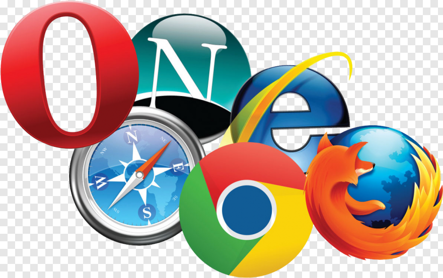
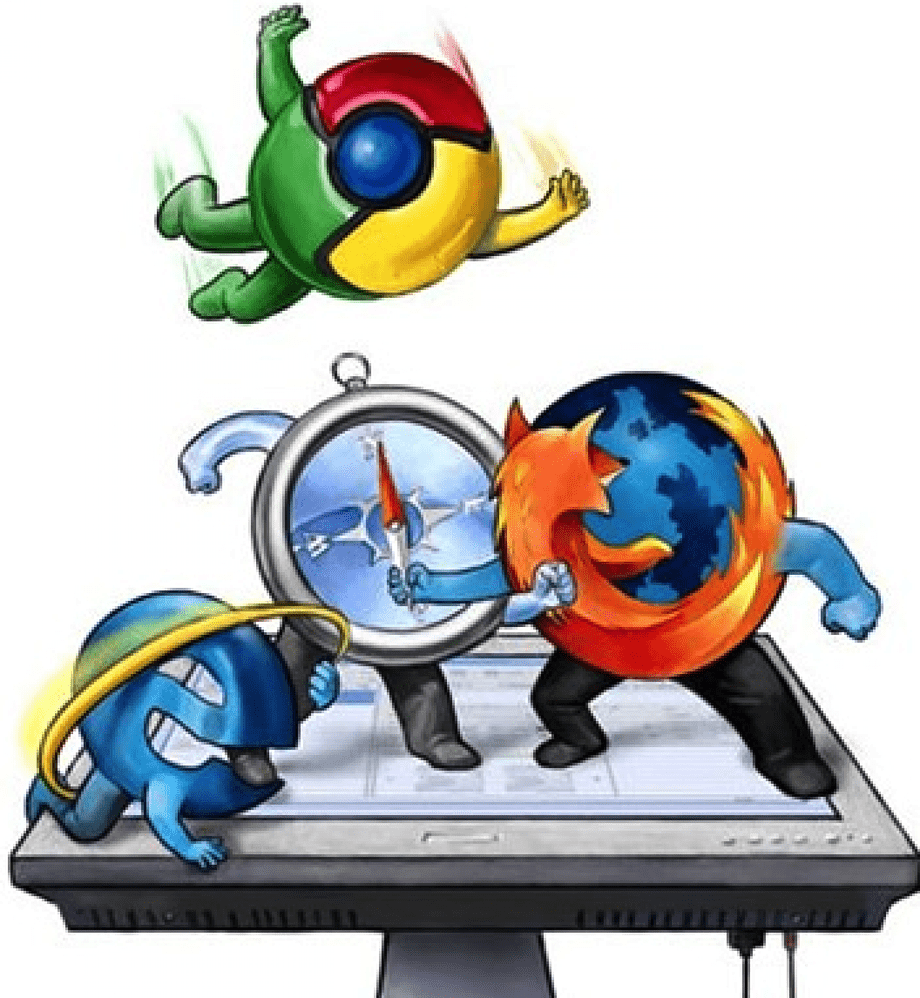

# Internet Wars: All You Need to Know

  

### The Internet ###

  The internet undoubtably is one of the most benefical and astonishing inventions ever created. It took nearly 70 years to perfect what we now know and use on a daily basis. It wasn't always as easy as it is now to go on google and search something as simple as pets or even access any user friendly website for that matter. The only ones who were able to work the internet were people who had previous deep knowledge about the computer, it definetly was not built for a ten year old, nonetheless a sixty year old. 

### Microsoft vs. Netscape ###
  We are all familiar with the famous Microsoft. Throughout many years, Microsoft has been able to uphold their position in the technology relm. Even amongst their competitors such as Apple, Google and IBM, they have still managed to keep their throne. However, their tactic has not always been fail and legal. Netscape, a company that not many people know of, because of Microsoft, was their main victim during the early 1990's. 
  
  
 #### Mosaic ####
  Mosaic, what soon became to be known as, Netscape was created in the Fall of 1993 by four college students who were fascinated by the World Wide Web, Rob McCool, Alex Toxic, Kou Montuli and Marc Andreessen. These four would soon be known as the "Illinois Geeks." When starting the creation Andreessen wanted to create a useful web for ones everyday life. This included having the ability to add videos, photos, etc. Something that would eventually turn into a point and click software and would soon become a graphical web browser. The Illinois Geeks launched Mosaic as a free download and that was a revolutionary moment for the internet world. Jim Clark --more background on him-- invested in Mosaic and partnered with the Illinois Geeks to soon start the creation of Netscape.
  
 #### Microsoft ####
  Microsoft, was created by Bill Gates and Paul Allen in April of 1975. Gates was a fresh Harvard Dropout when he launched his well known brand. His vision has always been to have a PC in every desktop, home and office running on Microsoft software and in the 1993 he was very close to his goal. Out of all the computers, at least 90% of them were installed with his software. However, Gates strongly believed that people should pay to use the web rather than getting free access to it.
  
 #### Netscape ####
  Summer of 1994, Jim Clark and his "gang" moved to San Francisco and months after, their fastest growing software company launched. Using Mosaic as refernece and with a sense of urgency due to Microsoft, the Illinois Geeks built a new browser called Netscape. On October 13, 1994, Netscape launched their new web browser called, Navigator and it was an instant success. They became the first company to create a gateway to the web from their browsers and due to this, the internet turned into a full-scale phenomenon becoming more important than the printing press and even television. This was the exact moment that the Browser War between Netscape and Microsoft began. 
  

  

### Browser War ###

#### The Infamous Email ####
  After the launch of Netscapes web browser: Navigator, Microsoft instantly felt the potential threat this upcoming company could have on their own company. With that in mind, Gates sent an email to his employees called *"Internet Tidal Wave"* declaring the web as the single most important development in computers since the PC. In addition, he made it clear to them that Netscape was officially considered one of their competitors and Microsoft needed to "Match and Beat" with the ultimate goal: **TO DEFEAT!**
  
  During the Summer of 1995, Netscape hired a lawyer called Garry Reback with his own personal long lasting vendetta against Microsoft. When the Illinos Geeks and Jim Clark launched Netscape, they were very naive and believed that everyone who they would be competing again would obey the law or be forced to. But when you have a company as big and powerful as Microsoft, the rules bend a little... so Gates thought. Microsoft became very unfriendly and tried to burn down Netscape by threatening to put business' out of business if they carried Netscape. 
  
  Months pass and by June 1995, Thomas Redin from Microsoft, decides to hold a face to face meeting in the Netscape Headquarters. This meeting however, became very controversial with two different stories being told.
  
  > Microsoft's Side of the Story:
  > "It was a free roaming discussion on how to work together with Netscape which lasted for six hours and was     
  > completely easy going"
  > - Microsoft Employee

On the other hand, Netscape story differed a little.

  > Netscape's Side of the Story:
  > Microsoft gave them an offer which translated to "I win and maybe you're there, or I win and you're not there"
  > The were offered a deal that was hard to resist, $1M for unlimited access to their technology... which was
  > equivalent to buying the company from them. The only other option they left them is that if they decided to
  > reject the offer, then they would leave but copy everything they've done and will do without any remorse.

Hours after the meeting was over, Reback was called and alerted to start the lawsuit against Microsoft since they vividly broke the law.

#### The Attack ####
In the year of Aug 1995, Netscape had no profit but still decided to go public since they needed to build a gaint windfall and the largest computerized lot. When their IPO dropped, luckily for them, Netscape's stock sky rocketed. It was on December 7th of the same year when Microsoft started getting very mad for the loss of recognition it was recieving. Bill Gates decides to create his own web browser called the *Internet Explorer* and releases it on the day Pearl Harbor happened. This was a symbolism that Microsoft would destroy Netscape.

Although Netscape had a headstart, Microsoft had fast financial resources and an abundance of coders who easily planned and analyzed Netscapes every move and copied every single version. Microsoft continued implementing his malicious tactic ultimatums. He told PC manufactuers to only install Internet Explorer, if they were to install Netscape, Microsoft would cancel their window license hence, running them out of business. The end was near once Microsoft decided to give windows for free as it was integrated into their operating systems. Because Netscape would charge in order to make profit, they lost the battle and eventually sold their company years later to AOL.

#### The "Victory" ####
In September 1997, Microsoft offically won and they threw a party in the heart of Netscapes headquarters, San Francisco. The arogance of their victory convinved them to throw their "e" logo into their fountain and it was all downhill for Netscape after that. However, it wasnt all fun and games for Microsoft either since their new competition was the U.S. Government. Netscape and their lawyer filed a lawsuit against Microsoft for Anti-Trust. The were found guilty for knowingly using windows wide monopoly to prevent consumers from getting a product. Gates was originally pleaded that he had no involvement but the Tidal Wave email was no help to him. The judge broked his company up to pieces and overnight, the stock market went down 30 Billion. The judge eventually thought the punishment was too cruel and split the company only into two pieces and Gates was forced to resign.
  
  
### Yahoo vs. Google ###

Internet wars started off publically with Internet Explorer and Netscape but many have continued to bloom throughout these years. Another company you are all well aware of that went through something similar but less intense is Yahoo and Google. Many companies tried to take a shot at creating Search, Yahoo and Excite, however, were unable to crack the code.

### Yahoo ###
In 1994, at their dorm in Strandford University, Jerry Yang and David Filo invented yahoo. They wanted to use the web to find a sneaky way to win fantasy basketball by looking up data from previous games. So with that logic they created a directory to help virgin web browsers find things by implementing categories and subcategories. Originally this was called "Jerry and David's Guide to the www" but eventually due to high volume of usage, changed to Yahoo. Michael Mortiz invested 2 million in Yahoo and decided to make money through advertisment. Yang and Filo were not fans of this idea for the simple fact that they did not want to alienate their loyal customers, but money had to be made. 

### Excite ###
Excite was a rival to Yahoo who had a more sophisticated search engine. Their logic was pure software where one types in a query and the software would search the web that contains the terms you entered. Both Yahoo and Excite were successful and they would copy one another for example with personalization and emails. However, because they were triumpht with their inventions thus far, they lost sight and stopped caring about perfecting their search engine.

  

### Google ###
It wasn't until Google came into the picture. Google was created by two PHD students named Larry Paige and Seregy Brim. The logic google decided to go towards is interpreting a link from page A to B, therefore, if a site was clicked 100 times more than another one, then it would be considered more relevant and be the top choice. Vinod Nocksa had the pleasure to introduce Google to Excite and told Excite that Googles logic was better but the deal never went through. Excite could have bought Google for 1 Million for the 1.4 Billion its worth now. Instead, Paige and Brim met with other investors such as David Cheriton and Andy Bechtolshem who instantly wrote a check on the spot for them. Another important investor was John Doerr, who also invested in Amazon and Netscape. He was convinced that the search would grow 10 Billion in revenue and he was right. He agreed to 12 Million and was match without a problem. 

### Growth of Google ###
By early 1999, Google did not want to be a cluster portal like the other search engine but rather a more user friendly one. Paige and Brim wanted to work with Bill Gross who cracked the code for the internet advertisment in 1990 with Overture. His logic relied heavily on keywords and came to the conclusion that when someone types a query, ultimately that means they are curious or want to buy what was searched. Ross believed the search engine was the perfect market research tool and marked keywords as valuable. An example of how this would work is someone typing in Car and BMW paying a lot money to be one of the top search results. In the end, things turned ugly between Google and Gross. Google wanted to blend Overture's keyword algorithm with Google's search results but no deal was formulated. Instead, Google came up with their super identical version of Overture but called it Ad Words. Because of this, Google was sued by Gross but it was nicely settle in court. In 2004, Google went public and went from $0 to $3 Billion annually. However unlike Microsoft, the CEO of Google, Eric Shmidt motto in the company is "Don't be a bully" which should be followed by everyone.

